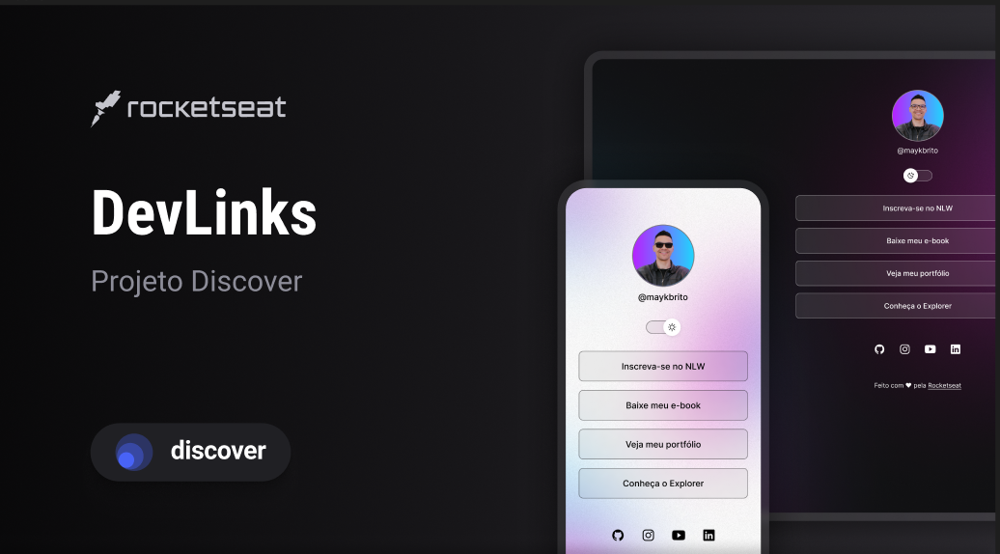

<h1 align='center'>DevLinks</h1>

Projeto promovido pela Rocketseat dentro do programa Discovery

    <a  href='#-tecnologias' > Tecnologias</a>&nbsp;&nbsp;&nbsp;|&nbsp;&nbsp;&nbsp
     <a  href='#-projeto' > Projeto</a>&nbsp;&nbsp;&nbsp;|&nbsp;&nbsp;&nbsp
      <a  href='#-layout' > Layout</a>&nbsp;&nbsp;&nbsp;|&nbsp;&nbsp;&nbsp
       <a  href='#-licença' > Licença</a>

    

 

    

##  🔧 Tecnologias
- HTML e CSS
- JavaScript
- Git e Github
- Figma

## 💻 Projeto

O DevLinks é uma agregador de links para usar como  um cartão de visitas online.

## 📝 Layout

Visualize o layout do projeto através [DESSE LINK](https://www.figma.com/file/bclgemi1RaVwOdFjbHgbPG/DevLinks-%E2%80%A2-Projeto-Discover-(Community)?node-id=10%3A620&mode=dev). É necessário ter uma conta no [Figma](https://www.figma.com/) para acessá-lo.

## :memo: Licença
Esse projeto está sob licença MIT